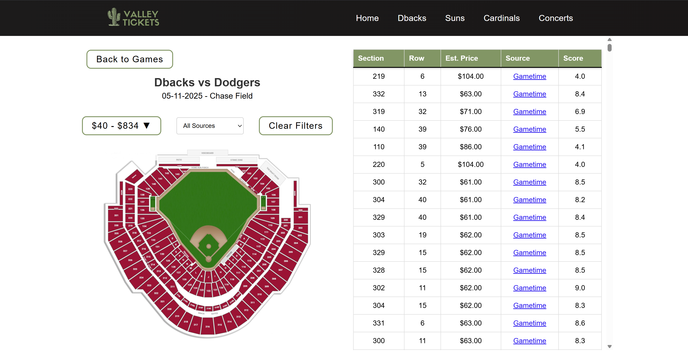
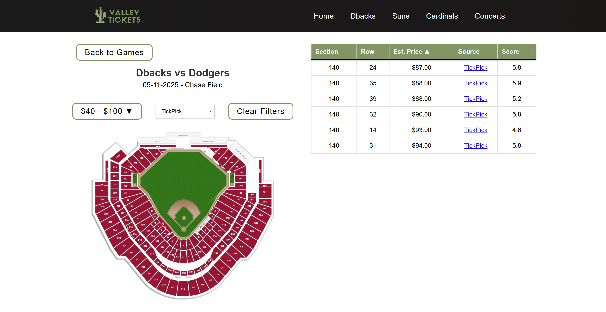

# Ticket Platform

A full-stack ticket aggregation platform designed to help users compare ticket listings from multiple sources in one centralized application.

This project was developed as a senior capstone project and demonstrates full-stack application development, REST API design, database integration, and frontend state management using real-world ticket data.

---

## Project Overview

Finding the best ticket prices often requires users to manually search across multiple ticket marketplaces. This project addresses that problem by providing a single platform where users can browse available games, view ticket listings, and filter results based on pricing, seating information, and ticket source.

The application follows a client-server architecture by separating the React frontend from the Express backend API. Ticket data is stored and retrieved through backend services connected to a SQLite database.

---

## Features

* Browse available games by date
* View detailed ticket listings for individual games
* Filter tickets by:

  * Price range
  * Ticket source
  * Seating section
* Sort tickets by:

  * Price
  * Section
  * Row
* Dynamic frontend rendering using React components
* Client-server communication through REST API endpoints
* Responsive interface with team logos and stadium imagery

---

## Application Architecture

```
React Frontend
      |
      | REST API Requests
      |
Express Backend
      |
      |
SQLite Database
      |
      |
Ticket Data
```

### Frontend

The React application handles:

* User interface rendering
* Navigation between pages
* Displaying games and ticket information
* Filtering and sorting interactions

### Backend

The Express backend handles:

* API routing
* Database communication
* Serving ticket information to the frontend

### Database

SQLite is used for local data storage and allows the backend API to retrieve ticket information efficiently.

---

## Tech Stack

### Frontend

* React
* React Router
* JavaScript
* CSS

### Backend

* Node.js
* Express.js
* SQLite

### Other Technologies

* REST API architecture
* Git/GitHub version control
* Client-server application design

---

## My Contributions

This project was developed collaboratively as part of my senior capstone. I contributed primarily to the frontend and backend development of the application.

My contributions included:

* Designed and developed React components for the user interface
* Implemented frontend routing and page navigation using React Router
* Built components for displaying games and ticket listings
* Developed backend API functionality using Express.js
* Connected frontend components with backend REST endpoints
* Integrated SQLite database queries for retrieving ticket information
* Implemented filtering and sorting functionality for ticket results
* Collaborated through Git/GitHub for version control and project development

---

## Repository Structure

```
ticket-platform/
└── ticket-website/
    ├── package.json
    ├── package-lock.json
    │
    ├── backend/
    │   ├── server.js
    │   └── tickets.db
    │
    └── frontend/
        ├── package.json
        ├── src/
        ├── public/
        └── build/
```

---

## Running the Application Locally

The frontend and backend must be run in separate terminals.

### 1. Install Backend Dependencies

From the project root:

```bash
cd ticket-website
npm install
```

### 2. Start the Backend Server

```bash
cd backend
node server.js
```

The backend runs on:

```
http://localhost:5000
```

### 3. Install Frontend Dependencies

Open a second terminal:

```bash
cd frontend
npm install
```

### 4. Start the Frontend Application

```bash
npm start
```

The React application runs on:

```
http://localhost:3000
```

---

## API Endpoints

The backend exposes REST API endpoints used by the frontend.

Examples:

| Endpoint        | Description                    |
| --------------- | ------------------------------ |
| GET /ticketsfb  | Retrieves football ticket data |
| GET /ticketsbsb | Retrieves baseball ticket data |

The frontend consumes these endpoints and dynamically displays ticket information.

---

## Screenshots

Add screenshots of the running application here:

### Homepage


### Ticket Listings



### Filtering and Sorting



---

## Future Improvements

Potential improvements include:

* Deploy frontend and backend applications to a cloud provider
* Add user authentication
* Improve automated data refreshing
* Add automated testing for API routes
* Improve date handling and timezone support
* Implement additional ticket marketplace integrations

---

## Project Background

This application was created as part of a senior capstone project to demonstrate full-stack software development skills, including frontend development, backend API design, database integration, and collaborative software engineering practices.
